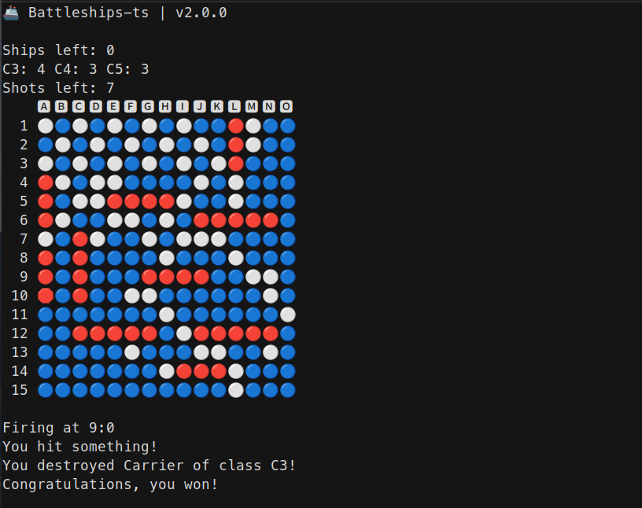

= TypeScript Battleships

Simple game done in TS as part of personal training.

== Why another Battleship clone?

I've started it with two things in mind:

* I want to be better at TypeScript,
* I want to create CLI game and fiddle with standard input/standard output,
* I want board game where **board is not represented as an array.**

It's common to create games like this with arrays. i.e. Tic-Tac-Toe when board
representation is similar to this:

[code]
----
array: [
    X | O | X
    O | X | O
    O | O | O
]
----

In this game, board is an object storing game elements as another objects.

Drawing of board is performed by checking each position for ``Target`` and it's state in memory.

Feel free to explore code.

== Setup

[code]
----
git clone https://github.com/sebastianluczak/boardgame-ts.git
cd boardgame-ts
npm install
npm test
npm start
----

====
Source code is located in ``./src``, build is done in ``./dist``.
====

== How to play

There is a limit of 100 rounds.

====
Press ``directional keys`` to move the cursor around table.
====

====
Press ``Space key`` to shoot.
====
